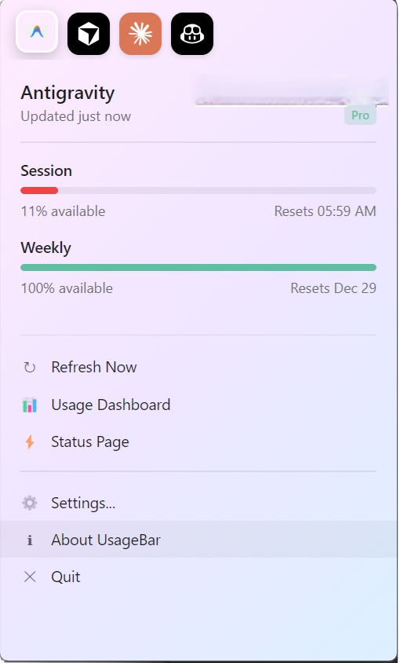
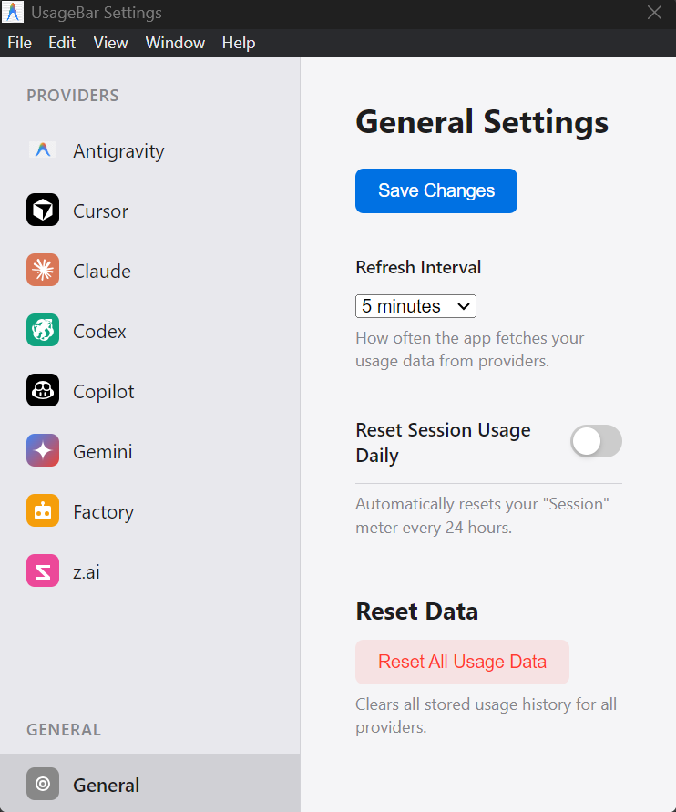

<p align="center">
  
</p>

<p align="center">
  <strong>🖥️ Windows system tray app for AI coding tool usage stats</strong>
</p>

<p align="center">
  
  
  <a href="https://ko-fi.com/ai_dev_2024"></a>
  
  
  
  <a href="https://startup.z.ai/"></a>
</p>

<p align="center">
  <a href="https://github.com/ai-dev-2024/UsageBar/releases/latest">
    
  </a>
</p>

<p align="center">
  <a href="#features">Features</a> •
  <a href="#screenshots">Screenshots</a> •
  <a href="#installation">Installation</a> •
  <a href="#supported-providers">Providers</a> •
  <a href="#acknowledgments">Acknowledgments</a>
</p>

---

## 🎯 What is UsageBar?

**UsageBar** is a lightweight **Windows-only** system tray application that displays your AI coding tool usage statistics at a glance. Stay on top of your usage limits across multiple AI coding assistants without switching between browser tabs or apps.

> ⚠️ **Windows Only** – This app is designed exclusively for Windows 10/11. For macOS, check out [CodexBar](https://github.com/steipete/CodexBar).

---

## ✨ Features

- 🖥️ **System Tray Integration** – Lives in your taskbar, always accessible
- 📊 **Real-time Usage Meters** – Session and weekly usage at a glance
- ⌨️ **Customizable Hotkey** – Default `Ctrl+Shift+U`, configurable in Settings
- ⏱️ **Reset Countdown Timers** – Shows "Resets in 2h 15m" for quick reference
- 🔔 **Quota Alert Notifications** – Windows toast notification when usage > 80% (configurable)
- 🔄 **Auto-Refresh** – Configurable refresh intervals (1-30 minutes)
- 🎨 **Glassmorphism UI** – Modern gradient design with transparency slider
- 🔌 **Multi-Provider Support** – Monitor usage across multiple AI tools
- ⚡ **Instant Toggle** – Enable/disable providers with one click
- 📈 **Dynamic Tray Icon** – Usage meter updates in real-time
- 🔗 **Quick Links** – Jump to dashboards and status pages
- 🪟 **Frameless & Resizable** – Drag to move, resize as needed
- 🆕 **One-Click Updates** – Version badge shows when updates are available
- 🚀 **Manual Refresh** – One-click refresh button in Settings
- 🔄 **Retry on Error** – Quick retry button when providers show errors
- 📱 **Auto-Start** – Launch UsageBar at Windows login

---

## 📸 Screenshots

<p align="center">
  
  <br>
  <em>System tray popup with transparent glass effect and usage stats</em>
</p>

<p align="center">
  
  <br>
  <em>Settings window with gradient glassmorphism theme</em>
</p>

---

## 📥 Installation

### Windows (Portable) - Recommended

> **Latest Version**: [v1.5.0](https://github.com/ai-dev-2024/UsageBar/releases/tag/v1.5.0) – Cloud CI/CD, auto-release, test coverage

1. Go to **[Releases](https://github.com/ai-dev-2024/UsageBar/releases)**.
2. Download `UsageBar-v1.4.1-Portable.zip`.
3. Extract the ZIP file to a folder of your choice (e.g., `Documents\UsageBar`).
4. Open the folder and double-click **`UsageBar.exe`** to run.
5. *(Optional)* Right-click `UsageBar.exe` → "Send to" → "Desktop (create shortcut)" for easy access.

### Auto-Updates

UsageBar automatically checks for updates on launch. When an update is available:
1. The version badge (top-right in Settings) changes to **"🔄 Update Available"**
2. Click it to download the update
3. Once downloaded, click **"✅ Install Update"** to restart with the new version

### Build from Source
```bash
# Clone the repository
git clone https://github.com/ai-dev-2024/UsageBar.git
cd UsageBar

# Install dependencies
npm install

# Run in development
npm run dev

# Build installer
npm run package
```

---

## 🔌 Supported Providers

> **Status Summary**: ✅ **3 Tested & Working** | ⚠️ **1 Limited** | ❓ **3 Untested**

| Provider | Auth Method | Status | Docs |
|----------|-------------|--------|------|
| **Cursor** | Browser login | ✅ Tested | [docs/cursor.md](docs/cursor.md) |
| **GitHub Copilot** | GitHub OAuth | ✅ Tested | [docs/copilot.md](docs/copilot.md) |
| **Antigravity (Windsurf)** | Auto-detect | ✅ Tested | [docs/antigravity.md](docs/antigravity.md) |
| **Claude** | Browser/CLI | ⚠️ Limited | [docs/claude.md](docs/claude.md) |
| **Codex (OpenAI)** | CLI | ❓ Untested | [docs/codex.md](docs/codex.md) |
| **Factory (Droid)** | App login | ❓ Untested | [docs/factory.md](docs/factory.md) |
| **z.ai** | API Token | ❓ Untested | [docs/zai.md](docs/zai.md) |

> 📖 See [docs/provider.md](docs/provider.md) for the provider authoring guide.

---

## ⚙️ Configuration

### General Settings
- **Refresh Interval**: 1, 2, 5, 10, 15, or 30 minutes
- **Reset Session Daily**: Auto-reset session meter every 24 hours
- **Global Hotkey**: Customizable keyboard shortcut (default: Ctrl+Shift+U)

### Provider Settings
Each provider can be individually enabled/disabled. Some require additional configuration:
- Providers with auto-detection work out-of-the-box
- CLI-based providers need you to run their login command
- API-based providers need an API key in Settings

---

## 🛠️ Development

### Local Setup
```bash
# Clone and install
git clone https://github.com/ai-dev-2024/UsageBar.git
cd UsageBar
npm install

# Run locally for testing
npm run dev
```

### What to Do Locally
| Task | Command |
|------|---------|
| Test changes | `npm run dev` |
| Format code | `npm run format` |
| Run tests locally | `npm run test` |

### Everything Else is Cloud-Only
| Task | Where |
|------|-------|
| Lint & type check | GitHub Actions |
| Unit tests | GitHub Actions |
| Build Windows installer | GitHub Actions |
| Create release | GitHub Actions |
| Close issues | GitHub Actions |

### Tech Stack
- **Electron 28** – Cross-platform desktop framework
- **TypeScript 5** – Type-safe JavaScript
- **Vitest** – Unit testing with coverage
- **Electron-Builder** – Packaging and distribution
- **Electron-Store** – Persistent settings storage
- **Prettier** – Code formatting
- **GitHub Actions** – Cloud CI/CD
- **Auto-Resolve** – Cloud-only issue/PR resolution on release

### ☁️ Cloud-Only Development

**Everything happens in GitHub's cloud - no local build servers needed!**

| Action | Where |
|--------|-------|
| TypeScript build | GitHub Actions |
| Unit tests | GitHub Actions |
| Test coverage | GitHub Actions |
| Windows installer build | GitHub Actions |
| Release creation | GitHub Actions |
| Issue resolution | GitHub Actions |

**To release (cloud-only):**
```bash
# Just push a version tag - everything else happens automatically!
git tag v1.5.0
git push origin v1.5.0

# GitHub Actions will:
# 1. Build and test
# 2. Create release with auto-generated notes
# 3. Upload Windows installer
# 4. Auto-close resolved issues
```

---

## 🙏 Acknowledgments

- **[CodexBar](https://github.com/steipete/CodexBar)** by [@steipete](https://github.com/steipete) – The original macOS inspiration for this project. UsageBar is the Windows counterpart, bringing the same great experience to Windows users.
- Thanks to all the AI coding tool providers for making development more productive!

---

## 💖 Support

If you find UsageBar helpful, consider supporting the development:

<a href="https://ko-fi.com/ai_dev_2024" target="_blank">
  
</a>

---

## 📄 License

MIT License – feel free to use, modify, and distribute.

---

<p align="center">
  Made with ❤️ for the Windows developer community
</p>
